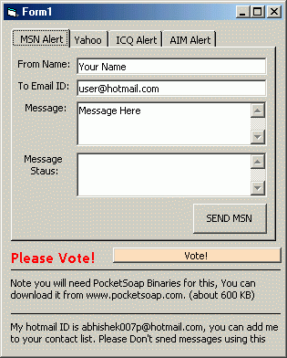



## IM Alert Web Service \- Send Messages to MSN, Yahoo, ICQ, AIM updated

### Description

This code allows you to sends a real-time alert message to any user of the 4 major Instant Messaging networks MSN, Yahoo, ICQ, and AIM. You don’t even need an account or need to install any clients. It a unique web service project on PSC.

You could integrate this within your own software systems to send yourself, your colleagues, or your friends automated messages, such as:

Appointment or task reminders e.g. Team meeting at 14:00.

Important day reminders e.g. birthday.

System alerts e.g. System has restarted after error.

Application alerts e.g. Stock management reports low inventory.

Information notifications e.g. Stock prices.

Please Vote
 
### More Info
 

             |
---                |---
**Submitted On**   |2003-09-08 23:55:08
**By**             |[Abhishek\.NET](https://github.com/Planet-Source-Code/PSCIndex/blob/master/ByAuthor/abhishek-net.md)
**Level**          |Advanced
**User Rating**    |4.6 (37 globes from 8 users)
**Compatibility**  |VB 4\.0 \(32\-bit\), VB 5\.0, VB 6\.0, VB Script, ASP \(Active Server Pages\) , VBA MS Access, VBA MS Excel
**Category**       |[Complete Applications](https://github.com/Planet-Source-Code/PSCIndex/blob/master/ByCategory/complete-applications__1-27.md)
**World**          |[Visual Basic](https://github.com/Planet-Source-Code/PSCIndex/blob/master/ByWorld/visual-basic.md)
**Archive File**   |[IM\_Alert\_W164305982003\.zip](https://github.com/Planet-Source-Code/abhishek-net-im-alert-web-service-send-messages-to-msn-yahoo-icq-aim-updated__1-48355/archive/master.zip)

